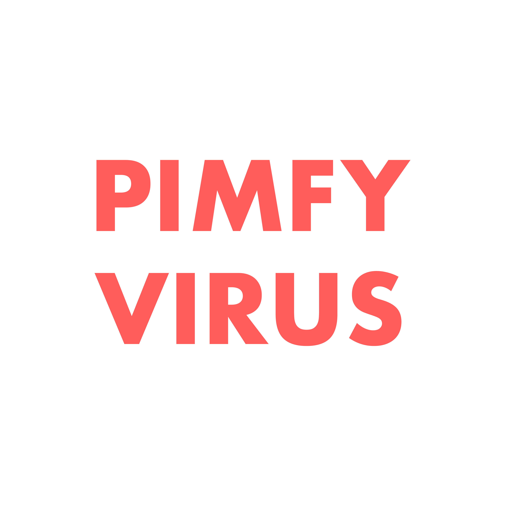
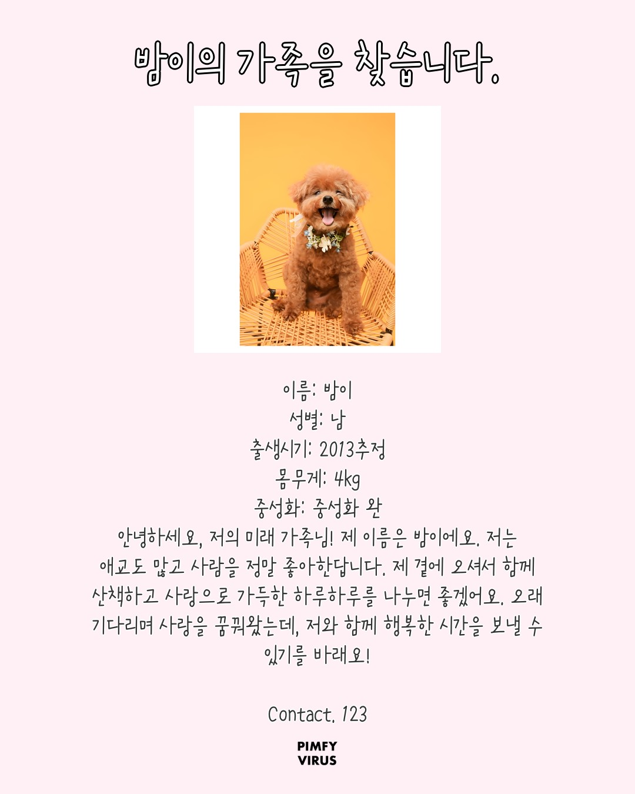

# 📸 PIMFY Photo (핌피포토)
> **유기견의 개성과 맥락을 시각화하는 AI 프로필 생성 서비스**

<p align="center">
  
  
</p>
<p align="center">
  <i>(왼쪽: 원본 유기동물 공고 데이터 / 오른쪽: AI를 통해 생성된 맞춤형 프로필)</i>
</p>


---

## 📝 프로젝트 개요 (Overview)

보호소 직원은 동물 돌봄에 집중해야 하는데 입양 홍보 사진 제작까지 직접 해야 한다.
저품질 이미지는 입양률 저하로 이어지고, AI가 보편화된 시대에도 이 영역엔 아무것도 적용되지 않았다.

**PIMFY Photo**는 사진 한 장을 입력하면 배경 제거 → 업스케일 → 배경 합성 → AI 스토리 생성 → 프로필 카드 완성까지 단일 파이프라인으로 자동 처리한다. 보호소 구독 모델 기반 SaaS로 지속 가능한 비즈니스 구조를 목표로 설계했다.

- **개발 기간**: 2025.10 ~ 2026.01 | 고도화 진행 중
- **배포 환경**: NCP GPU 서버 (V100) · Docker
- **핵심 가치**: AI 기술이 닿지 않는 영역에 직접 적용 · 정량적 성능 최적화 · 사회적 임팩트 정량화

---

## 🏆 핵심 성과 (Key Achievements)

| 지표 | Before | After | 개선율 |
|------|--------|-------|--------|
| AI 추론 시간 | 360초 (6분) | 30초 이내 | **91% 단축** |
| GPU 메모리 점유 | FP32 기준 | FP16 양자화 적용 | **50% 절감** |
| Vision API 호출 비용 | 전체 이미지 호출 | OpenCV 1차 필터링 후 호출 | **70% 감소** |
| 모바일 저장 UX Depth | 4단계 | 2단계 | Web Share API 도입 |

---

## 🚀 핵심 서비스 (Core Service)

### 🧡 1. 핌피바이러스 프로필
핌피바이러스 DB의 실시간 공고 데이터와 연동하여, 유기동물의 기본 정보를 구조화된 프로필 카드로 자동 변환한다.

### 🏠 2. 입양·임보 프로필
유기견의 성격과 특징을 AI가 분석하여, 차가운 보호소 배경 대신 SDXL로 생성한 파스텔톤 배경에 합성한다.

### 📸 3. 스튜디오 프로필
Real-ESRGAN + TensorRT 기반 4배 업스케일링으로 전문 스튜디오 수준의 고품질 프로필을 제공한다.

---

## 🏗 시스템 아키텍처 (System Architecture)

```
이미지 입력
    │
    ▼
[1차 필터링] OpenCV — 선명도 · 밝기 · 얼굴 감지 (룰 기반)
    │ Vision API 호출 70% 사전 차단
    ▼
[2차 필터링] GPT-4.1 Vision — 5항목 25점 채점
    │ gradient · lighting · background · model_vibe · sharpness
    │ 15점 미만 탈락
    ▼
[Real-ESRGAN] 4배 업스케일링
    │ PyTorch → ONNX Export → TensorRT 최적화
    ▼
[rembg] 배경 제거
    ▼
[SDXL] 랜덤 파스텔톤 배경 생성 (NCP GPU 추론)
    ▼
[GPT-4.1] 공공데이터 기반 감성 스토리 생성 + 텍스트 오버레이
    ▼
프로필 카드 출력 + Web Share API 공유
```

---

## ⚙️ 기술 스택 (Tech Stack)

| 분류 | 기술 |
|------|------|
| AI 모델 | Real-ESRGAN · SDXL · rembg · GPT-4.1 Vision |
| 전처리 | OpenCV |
| 최적화 | ONNX Export · TensorRT · FP16 양자화 |
| Backend | FastAPI · PyTorch · Python |
| Frontend | Next.js · TypeScript · TailwindCSS |
| DB | MariaDB · SQL |
| 인프라 | NCP GPU 서버 (V100) · Docker · Cafe24 |

---

## 🔥 핵심 트러블슈팅 (Troubleshooting)

### 1️⃣ SDXL 추론 지연 91% 단축 — Singleton + FP16 양자화

**문제**: 이미지 1장당 추론 시간 약 360초(6분). 실시간 서비스 불가 수준의 병목.

**원인**:
- API 요청마다 대용량 모델을 새로 로드하는 구조
- FP32 가중치의 과도한 GPU 메모리 점유로 추론 속도 저하

**해결**:
- **Singleton Pattern 적용**: 서버 구동 시 모델을 1회만 메모리에 상주시켜 재사용
- **FP16 Half Precision 양자화**: 가중치 경량화로 연산 속도 향상 + GPU 메모리 50% 절감

**결과**: 360초 → **30초 이내** 단축. 실질적인 서비스 운영 가능 상태 확보.

---

### 2️⃣ Vision API 호출 비용 70% 감소 — 이중 필터링 파이프라인

**문제**: 모든 이미지에 GPT-4.1 Vision API를 호출하면 비용 폭증. 저품질 이미지를 API 호출 전에 걸러낼 방법이 필요했다.

**해결**:
- **1차 필터링 (OpenCV)**: 선명도(Laplacian variance) · 밝기 · 얼굴 감지를 룰 기반으로 사전 차단. 연산 비용 없이 부적합 이미지를 제거.
- **2차 필터링 (GPT-4.1 Vision)**: 통과한 이미지에만 5개 항목(gradient · lighting · background · model_vibe · sharpness) 25점 채점. 15점 미만 탈락.

**결과**: Vision API 호출 **70% 감소**. 비용 최적화와 품질 게이팅을 동시에 달성.

---

### 3️⃣ 모바일 저장 UX 개선 — Web Share API

**문제**: 모바일 브라우저 보안 정책으로 이미지 다운로드 시 갤러리가 아닌 '파일 앱'으로 저장. 사용자 저장 Depth 4단계.

**해결**: Web Share API 도입으로 시스템 공유 시트 호출 → 갤러리 직접 저장. Depth **4단계 → 2단계** 축소.

---

### 4️⃣ DB 타입 불일치 및 Mixed Content 이미지 렌더링 실패

**문제**: 특정 DB 환경에서 문자열이 `bytes` 타입으로 반환되어 서버 에러 발생. HTTP 이미지 URL이 HTTPS 환경에서 Mixed Content로 렌더링 실패.

**해결**:
- `safe_dec()` 유틸리티 함수로 모든 DB 반환값 타입 검증 처리
- 이미지 데이터를 **Base64**로 인코딩하여 전송, Mixed Content 이슈 완전 차단

---

## 📁 프로젝트 구조 (Project Structure)

```
pimfy-photo/
├── main.py                  # FastAPI 앱 + 3가지 프로필 생성 엔드포인트
├── sdxl_server.py           # SDXL 배경 생성 서버 (별도 프로세스)
├── export_onnx_final.py     # Real-ESRGAN ONNX 변환 스크립트
├── requirements.txt
└── requirements_sdxl.txt    # SDXL 전용 의존성 분리
```

---

## 🌱 향후 계획 (Roadmap)

- [ ] 보호소 구독 모델 기반 SaaS 구조 완성
- [ ] 입양률 개선 효과 정량화 (A/B 테스트 설계)
- [ ] 미용 · F&B · 소매업 도메인으로 파이프라인 확장

---
